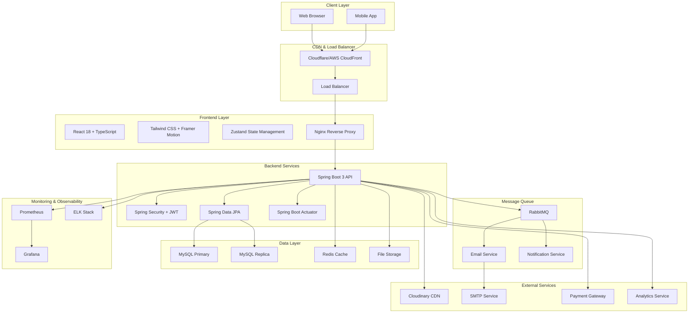
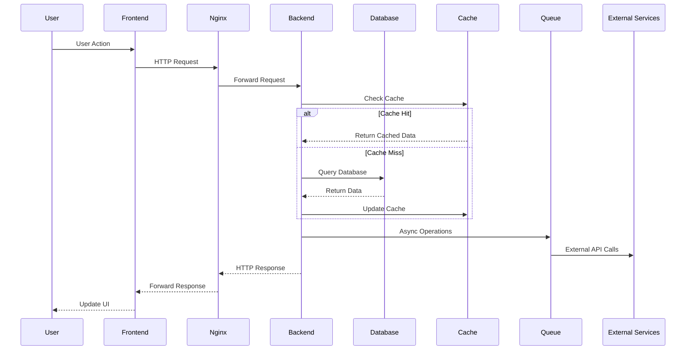
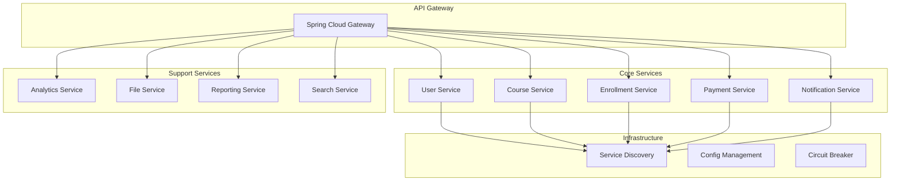

# 🎓 Modern Learning Management System (LMS)

[](https://github.com/your-org/modern-lms/actions)
[](https://github.com/your-org/modern-lms/actions)
[](https://opensource.org/licenses/MIT)
[](https://github.com/your-org/modern-lms/releases)

A comprehensive, modern Learning Management System built with **Spring Boot 3**, **React 18**, and **TypeScript**. Features include course management, user authentication, real-time messaging, certificate generation, and comprehensive analytics.

## 🌟 Features

### 👥 User Management
- **Multi-role Authentication** (Student, Instructor, Admin)
- **JWT-based Security** with refresh tokens
- **Email Verification** and password reset
- **Profile Management** with avatar upload
- **Instructor Approval** workflow

### 📚 Course Management
- **Rich Course Creation** with multimedia support
- **Lesson Management** with video streaming
- **Progress Tracking** and completion certificates
- **Course Reviews** and ratings
- **Wishlist** functionality
- **Category-based Organization**

### 💰 Payment & Enrollment
- **Secure Payment Processing** (Stripe integration)
- **Enrollment Management**
- **Instructor Earnings** tracking
- **Commission Management**

### 📊 Analytics & Reporting
- **Real-time Dashboards** for all user roles
- **Course Analytics** and performance metrics
- **User Engagement** tracking
- **Revenue Reports**

### 🔔 Communication
- **Real-time Notifications** via RabbitMQ
- **Email Notifications** for key events
- **In-app Messaging** system

### 🎨 Modern UI/UX
- **Responsive Design** with Tailwind CSS
- **Dark/Light Mode** toggle
- **Glassmorphism** design elements
- **Smooth Animations** with Framer Motion
- **Accessibility** compliant (WCAG 2.1)

## 🏗️ Architecture Overview

### System Architecture



### Data Flow Architecture



### Microservices Architecture (Future)



## 🚀 Quick Start

### Prerequisites

- **Java 17+**
- **Node.js 18+**
- **MySQL 8.0+**
- **RabbitMQ 3.12+**
- **Redis 7+**
- **Docker & Docker Compose** (optional)

### 🐳 Docker Setup (Recommended)

1. **Clone the repository**
   ```bash
   git clone https://github.com/your-org/modern-lms.git
   cd modern-lms
   ```

2. **Copy environment file**
   ```bash
   cp .env.example .env
   # Edit .env with your configuration
   ```

3. **Start with Docker Compose**
   ```bash
   docker-compose up -d
   ```

4. **Access the application**
   - Frontend: http://localhost:5173
   - Backend API: http://localhost:8080/api
   - RabbitMQ Management: http://localhost:15672

### 🔧 Manual Setup

#### Backend Setup

1. **Navigate to backend directory**
   ```bash
   cd backend
   ```

2. **Configure database**
   ```bash
   # Create MySQL database
   mysql -u root -p
   CREATE DATABASE modern_lms;
   CREATE USER 'lms_user'@'localhost' IDENTIFIED BY 'lms_password';
   GRANT ALL PRIVILEGES ON modern_lms.* TO 'lms_user'@'localhost';
   ```

3. **Update application.yml**
   ```yaml
   spring:
     datasource:
       url: jdbc:mysql://localhost:3306/modern_lms
       username: lms_user
       password: lms_password
   ```

4. **Run the backend**
   ```bash
   mvn spring-boot:run
   ```

#### Frontend Setup

1. **Navigate to frontend directory**
   ```bash
   cd ../  # Back to root
   ```

2. **Install dependencies**
   ```bash
   npm install
   ```

3. **Start development server**
   ```bash
   npm run dev
   ```

## 📋 Testing

### Backend Testing

```bash
cd backend

# Run unit tests
mvn test

# Run integration tests
mvn test -Dtest=**/*IntegrationTest

# Generate test coverage report
mvn jacoco:report
```

### Frontend Testing

```bash
# Run unit tests
npm run test

# Run tests with coverage
npm run test:coverage

# Run tests in watch mode
npm run test:watch
```

### End-to-End Testing

```bash
# Install Playwright browsers
npx playwright install

# Run E2E tests
npm run test:e2e

# Run E2E tests with UI
npm run test:e2e:ui
```

## 🚀 Deployment

### Production Deployment with Docker

1. **Build production images**
   ```bash
   docker-compose -f docker-compose.prod.yml build
   ```

2. **Deploy to production**
   ```bash
   docker-compose -f docker-compose.prod.yml up -d
   ```

### Kubernetes Deployment

1. **Apply Kubernetes manifests**
   ```bash
   kubectl apply -f k8s/namespace.yaml
   kubectl apply -f k8s/configmap.yaml
   kubectl apply -f k8s/secrets.yaml
   kubectl apply -f k8s/
   ```

2. **Verify deployment**
   ```bash
   kubectl get pods -n lms-system
   kubectl get services -n lms-system
   ```

### CI/CD Pipeline

The project includes GitHub Actions workflows for:

- **Continuous Integration**: Automated testing on pull requests
- **Security Scanning**: Dependency and container vulnerability scans
- **Deployment**: Automated deployment to staging and production
- **Monitoring**: Health checks and performance monitoring

## 📊 Monitoring & Observability

### Metrics & Monitoring

- **Prometheus**: Metrics collection
- **Grafana**: Dashboards and visualization
- **Spring Boot Actuator**: Application health and metrics
- **Custom Dashboards**: Business metrics and KPIs

### Logging

- **Structured Logging**: JSON format with correlation IDs
- **Log Aggregation**: Centralized logging with ELK stack
- **Error Tracking**: Real-time error monitoring

### Health Checks

- **Liveness Probes**: Application health status
- **Readiness Probes**: Service availability
- **Custom Health Indicators**: Database, cache, and external service checks

## 🔒 Security

### Authentication & Authorization

- **JWT Tokens**: Stateless authentication
- **Role-based Access Control**: Fine-grained permissions
- **Password Security**: BCrypt hashing with salt
- **Session Management**: Secure session handling

### Security Measures

- **HTTPS Enforcement**: SSL/TLS encryption
- **CORS Configuration**: Cross-origin request security
- **Input Validation**: Comprehensive data validation
- **SQL Injection Prevention**: Parameterized queries
- **XSS Protection**: Content Security Policy headers

### Security Scanning

```bash
# Run security scan
./security/security-scan.sh

# Check for vulnerabilities
npm audit
mvn org.owasp:dependency-check-maven:check
```

## 🤝 Contributing

We welcome contributions! Please see our [Contributing Guide](CONTRIBUTING.md) for details.

### Development Workflow

1. Fork the repository
2. Create a feature branch
3. Make your changes
4. Add tests for new functionality
5. Run the test suite
6. Submit a pull request

### Code Standards

- **Java**: Follow Google Java Style Guide
- **TypeScript**: Use ESLint and Prettier
- **Commit Messages**: Follow Conventional Commits
- **Documentation**: Update README and inline docs

## 📄 API Documentation

### REST API

The API documentation is available at:
- **Swagger UI**: http://localhost:8080/api/swagger-ui.html
- **OpenAPI Spec**: http://localhost:8080/api/v3/api-docs

### Key Endpoints

```
Authentication:
POST /api/auth/login
POST /api/auth/register
POST /api/auth/refresh

Courses:
GET    /api/courses
POST   /api/courses
GET    /api/courses/{id}
PUT    /api/courses/{id}
DELETE /api/courses/{id}

Users:
GET    /api/users/profile
PUT    /api/users/profile
GET    /api/admin/users

Enrollments:
POST   /api/enrollments
GET    /api/enrollments/my-courses
PUT    /api/enrollments/{id}/progress
```

## 🔧 Configuration

### Environment Variables

Key configuration options:

```bash
# Database
DB_HOST=localhost
DB_PORT=3306
DB_NAME=modern_lms
DB_USERNAME=lms_user
DB_PASSWORD=lms_password

# JWT
JWT_SECRET=your-secret-key
JWT_EXPIRATION=86400000

# External Services
CLOUDINARY_CLOUD_NAME=your-cloud-name
CLOUDINARY_API_KEY=your-api-key
CLOUDINARY_API_SECRET=your-api-secret

# Email
MAIL_HOST=smtp.gmail.com
MAIL_USERNAME=your-email@gmail.com
MAIL_PASSWORD=your-app-password
```

See [.env.example](.env.example) for complete configuration options.

## 📈 Performance

### Optimization Features

- **Database Indexing**: Optimized queries with proper indexes
- **Caching Strategy**: Redis for session and data caching
- **CDN Integration**: Cloudinary for media delivery
- **Lazy Loading**: Frontend component and route-based code splitting
- **Connection Pooling**: HikariCP for database connections

### Performance Monitoring

- **Response Time Tracking**: 95th percentile under 200ms
- **Database Query Optimization**: Slow query monitoring
- **Memory Usage**: JVM and application memory tracking
- **Throughput Metrics**: Requests per second monitoring

## 🐛 Troubleshooting

### Common Issues

1. **Database Connection Issues**
   ```bash
   # Check MySQL service
   systemctl status mysql
   
   # Verify connection
   mysql -u lms_user -p -h localhost modern_lms
   ```

2. **RabbitMQ Connection Issues**
   ```bash
   # Check RabbitMQ service
   systemctl status rabbitmq-server
   
   # Check management interface
   curl http://localhost:15672
   ```

3. **Frontend Build Issues**
   ```bash
   # Clear node modules and reinstall
   rm -rf node_modules package-lock.json
   npm install
   ```

### Logs and Debugging

```bash
# Backend logs
tail -f backend/logs/application.log

# Frontend development logs
npm run dev

# Docker container logs
docker-compose logs -f backend
docker-compose logs -f frontend
```

## 📞 Support

- **Documentation**: [Wiki](https://github.com/your-org/modern-lms/wiki)
- **Issues**: [GitHub Issues](https://github.com/your-org/modern-lms/issues)
- **Discussions**: [GitHub Discussions](https://github.com/your-org/modern-lms/discussions)
- **Email**: support@modernlms.com

## 📜 License

This project is licensed under the MIT License - see the [LICENSE](LICENSE) file for details.

## 🙏 Acknowledgments

- Spring Boot team for the excellent framework
- React team for the powerful frontend library
- All open-source contributors who made this project possible

---

**Made with ❤️ by the Modern LMS Team**
