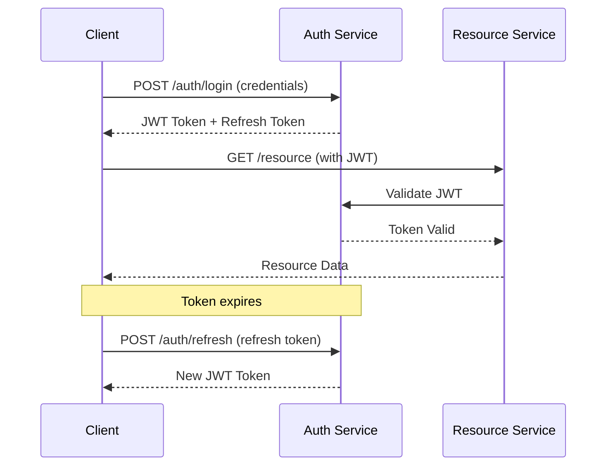

# 📚 API Documentation

This document provides comprehensive API documentation for the Modern LMS platform.

## 🔗 Base URL

- **Development**: `http://localhost:8080/api`
- **Production**: `https://api.yourdomain.com/api`

## 🔐 Authentication

The API uses JWT (JSON Web Tokens) for authentication. Include the token in the Authorization header:

```
Authorization: Bearer <your-jwt-token>
```

### Authentication Flow



## 📋 API Endpoints

### Authentication Endpoints

#### POST /auth/login
Authenticate user and receive JWT token.

**Request Body:**
```json
{
  "email": "user@example.com",
  "password": "password123"
}
```

**Response:**
```json
{
  "success": true,
  "message": "Login successful",
  "data": {
    "token": "eyJhbGciOiJIUzI1NiIsInR5cCI6IkpXVCJ9...",
    "refreshToken": "refresh_token_here",
    "user": {
      "id": "user-id",
      "email": "user@example.com",
      "firstName": "John",
      "lastName": "Doe",
      "role": "STUDENT",
      "avatar": "https://example.com/avatar.jpg",
      "approved": true
    }
  }
}
```

#### POST /auth/register
Register a new user account.

**Request Body:**
```json
{
  "email": "newuser@example.com",
  "password": "password123",
  "firstName": "Jane",
  "lastName": "Smith",
  "role": "STUDENT"
}
```

**Response:**
```json
{
  "success": true,
  "message": "User registered successfully",
  "data": {
    "id": "new-user-id",
    "email": "newuser@example.com",
    "firstName": "Jane",
    "lastName": "Smith",
    "role": "STUDENT",
    "approved": false
  }
}
```

#### POST /auth/refresh
Refresh JWT token using refresh token.

**Request Body:**
```json
{
  "refreshToken": "refresh_token_here"
}
```

#### POST /auth/logout
Logout user and invalidate tokens.

**Headers:** `Authorization: Bearer <token>`

### User Management Endpoints

#### GET /users/profile
Get current user profile.

**Headers:** `Authorization: Bearer <token>`

**Response:**
```json
{
  "success": true,
  "data": {
    "id": "user-id",
    "email": "user@example.com",
    "firstName": "John",
    "lastName": "Doe",
    "role": "STUDENT",
    "avatar": "https://example.com/avatar.jpg",
    "createdAt": "2024-01-15T10:00:00Z",
    "enrollmentCount": 5,
    "completedCourses": 2
  }
}
```

#### PUT /users/profile
Update user profile.

**Headers:** `Authorization: Bearer <token>`

**Request Body:**
```json
{
  "firstName": "John",
  "lastName": "Updated",
  "bio": "Updated bio"
}
```

#### POST /users/avatar
Upload user avatar.

**Headers:** 
- `Authorization: Bearer <token>`
- `Content-Type: multipart/form-data`

**Request Body:** Form data with `avatar` file field

### Course Management Endpoints

#### GET /courses
Get paginated list of courses.

**Query Parameters:**
- `page` (default: 0)
- `size` (default: 10)
- `category` (optional)
- `level` (optional: BEGINNER, INTERMEDIATE, ADVANCED)
- `search` (optional)
- `sortBy` (optional: title, price, rating, createdAt)
- `sortDir` (optional: asc, desc)

**Response:**
```json
{
  "success": true,
  "data": {
    "content": [
      {
        "id": "course-id",
        "title": "React Development Course",
        "description": "Learn React from basics to advanced",
        "thumbnail": "https://example.com/thumbnail.jpg",
        "price": 99.99,
        "category": "Web Development",
        "level": "INTERMEDIATE",
        "duration": 3600,
        "rating": 4.5,
        "totalRatings": 150,
        "enrolledCount": 500,
        "instructor": {
          "id": "instructor-id",
          "firstName": "Jane",
          "lastName": "Instructor",
          "avatar": "https://example.com/instructor.jpg"
        },
        "createdAt": "2024-01-01T00:00:00Z"
      }
    ],
    "totalElements": 50,
    "totalPages": 5,
    "size": 10,
    "number": 0
  }
}
```

#### GET /courses/{id}
Get detailed course information.

**Response:**
```json
{
  "success": true,
  "data": {
    "id": "course-id",
    "title": "React Development Course",
    "description": "Comprehensive React course...",
    "thumbnail": "https://example.com/thumbnail.jpg",
    "price": 99.99,
    "category": "Web Development",
    "level": "INTERMEDIATE",
    "duration": 3600,
    "rating": 4.5,
    "totalRatings": 150,
    "enrolledCount": 500,
    "instructor": {
      "id": "instructor-id",
      "firstName": "Jane",
      "lastName": "Instructor",
      "bio": "Experienced React developer...",
      "avatar": "https://example.com/instructor.jpg"
    },
    "lessons": [
      {
        "id": "lesson-id",
        "title": "Introduction to React",
        "description": "Getting started with React",
        "duration": 300,
        "order": 1,
        "isPreview": true,
        "videoUrl": "https://example.com/video.mp4"
      }
    ],
    "requirements": ["Basic JavaScript knowledge"],
    "learningOutcomes": ["Build React applications"],
    "createdAt": "2024-01-01T00:00:00Z",
    "updatedAt": "2024-01-15T00:00:00Z"
  }
}
```

#### POST /courses
Create a new course (Instructor/Admin only).

**Headers:** `Authorization: Bearer <token>`

**Request Body:**
```json
{
  "title": "New Course Title",
  "description": "Course description",
  "category": "Web Development",
  "level": "BEGINNER",
  "price": 79.99,
  "requirements": ["Basic programming knowledge"],
  "learningOutcomes": ["Build web applications"]
}
```

#### PUT /courses/{id}
Update course information (Instructor/Admin only).

#### DELETE /courses/{id}
Delete a course (Instructor/Admin only).

### Enrollment Endpoints

#### POST /enrollments
Enroll in a course.

**Headers:** `Authorization: Bearer <token>`

**Request Body:**
```json
{
  "courseId": "course-id"
}
```

**Response:**
```json
{
  "success": true,
  "message": "Successfully enrolled in course",
  "data": {
    "id": "enrollment-id",
    "courseId": "course-id",
    "userId": "user-id",
    "enrolledAt": "2024-01-15T10:00:00Z",
    "progressPercentage": 0,
    "isActive": true
  }
}
```

#### GET /enrollments/my-courses
Get user's enrolled courses.

**Headers:** `Authorization: Bearer <token>`

**Response:**
```json
{
  "success": true,
  "data": [
    {
      "id": "enrollment-id",
      "course": {
        "id": "course-id",
        "title": "React Development Course",
        "thumbnail": "https://example.com/thumbnail.jpg"
      },
      "progressPercentage": 45,
      "lastAccessedAt": "2024-01-14T15:30:00Z",
      "enrolledAt": "2024-01-01T10:00:00Z",
      "completedAt": null,
      "isActive": true
    }
  ]
}
```

#### PUT /enrollments/{id}/progress
Update course progress.

**Headers:** `Authorization: Bearer <token>`

**Request Body:**
```json
{
  "lessonId": "lesson-id",
  "completed": true,
  "progressPercentage": 50
}
```

### Review Endpoints

#### POST /courses/{courseId}/reviews
Add a course review.

**Headers:** `Authorization: Bearer <token>`

**Request Body:**
```json
{
  "rating": 5,
  "comment": "Excellent course! Highly recommended."
}
```

#### GET /courses/{courseId}/reviews
Get course reviews.

**Query Parameters:**
- `page` (default: 0)
- `size` (default: 10)

### Admin Endpoints

#### GET /admin/users
Get all users (Admin only).

**Headers:** `Authorization: Bearer <token>`

**Query Parameters:**
- `page`, `size`, `role`, `approved`

#### PUT /admin/users/{id}/approve
Approve instructor account (Admin only).

#### GET /admin/analytics
Get platform analytics (Admin only).

**Response:**
```json
{
  "success": true,
  "data": {
    "totalUsers": 1250,
    "totalCourses": 85,
    "totalEnrollments": 3420,
    "totalRevenue": 125000.50,
    "monthlyGrowth": {
      "users": 12.5,
      "courses": 8.3,
      "revenue": 15.2
    },
    "topCategories": [
      {
        "name": "Web Development",
        "courseCount": 25,
        "enrollmentCount": 1200
      }
    ]
  }
}
```

## 📊 Response Format

All API responses follow a consistent format:

### Success Response
```json
{
  "success": true,
  "message": "Operation successful",
  "data": { /* response data */ },
  "timestamp": "2024-01-15T10:00:00Z"
}
```

### Error Response
```json
{
  "success": false,
  "message": "Error description",
  "error": {
    "code": "ERROR_CODE",
    "details": "Detailed error information"
  },
  "timestamp": "2024-01-15T10:00:00Z"
}
```

## 🚫 Error Codes

| HTTP Status | Error Code | Description |
|-------------|------------|-------------|
| 400 | VALIDATION_ERROR | Request validation failed |
| 401 | UNAUTHORIZED | Authentication required |
| 403 | FORBIDDEN | Insufficient permissions |
| 404 | NOT_FOUND | Resource not found |
| 409 | CONFLICT | Resource already exists |
| 429 | RATE_LIMIT_EXCEEDED | Too many requests |
| 500 | INTERNAL_ERROR | Server error |

## 🔄 Rate Limiting

API endpoints are rate-limited to prevent abuse:

- **Authentication endpoints**: 5 requests per minute
- **General endpoints**: 100 requests per minute
- **File upload endpoints**: 10 requests per minute

Rate limit headers are included in responses:
```
X-RateLimit-Limit: 100
X-RateLimit-Remaining: 95
X-RateLimit-Reset: 1642248000
```

## 📝 Request/Response Examples

### Complete Course Enrollment Flow

1. **Login**
```bash
curl -X POST http://localhost:8080/api/auth/login \
  -H "Content-Type: application/json" \
  -d '{"email":"student@example.com","password":"password123"}'
```

2. **Browse Courses**
```bash
curl -X GET "http://localhost:8080/api/courses?category=Web Development&page=0&size=5" \
  -H "Authorization: Bearer <token>"
```

3. **Get Course Details**
```bash
curl -X GET http://localhost:8080/api/courses/course-id \
  -H "Authorization: Bearer <token>"
```

4. **Enroll in Course**
```bash
curl -X POST http://localhost:8080/api/enrollments \
  -H "Authorization: Bearer <token>" \
  -H "Content-Type: application/json" \
  -d '{"courseId":"course-id"}'
```

5. **Update Progress**
```bash
curl -X PUT http://localhost:8080/api/enrollments/enrollment-id/progress \
  -H "Authorization: Bearer <token>" \
  -H "Content-Type: application/json" \
  -d '{"lessonId":"lesson-id","completed":true,"progressPercentage":25}'
```

## 🔧 SDK and Client Libraries

### JavaScript/TypeScript
```typescript
import { LMSClient } from '@modern-lms/client';

const client = new LMSClient({
  baseURL: 'http://localhost:8080/api',
  token: 'your-jwt-token'
});

// Get courses
const courses = await client.courses.list({
  category: 'Web Development',
  page: 0,
  size: 10
});

// Enroll in course
const enrollment = await client.enrollments.create({
  courseId: 'course-id'
});
```

### Python
```python
from modern_lms_client import LMSClient

client = LMSClient(
    base_url='http://localhost:8080/api',
    token='your-jwt-token'
)

# Get courses
courses = client.courses.list(
    category='Web Development',
    page=0,
    size=10
)

# Enroll in course
enrollment = client.enrollments.create(course_id='course-id')
```

## 📚 Additional Resources

- **OpenAPI Specification**: `/api/v3/api-docs`
- **Swagger UI**: `/api/swagger-ui.html`
- **Postman Collection**: [Download](./postman/Modern-LMS-API.postman_collection.json)
- **API Testing Guide**: [Testing Guide](./TESTING.md)

---

For more information, visit our [Developer Portal](https://developers.modernlms.com).
